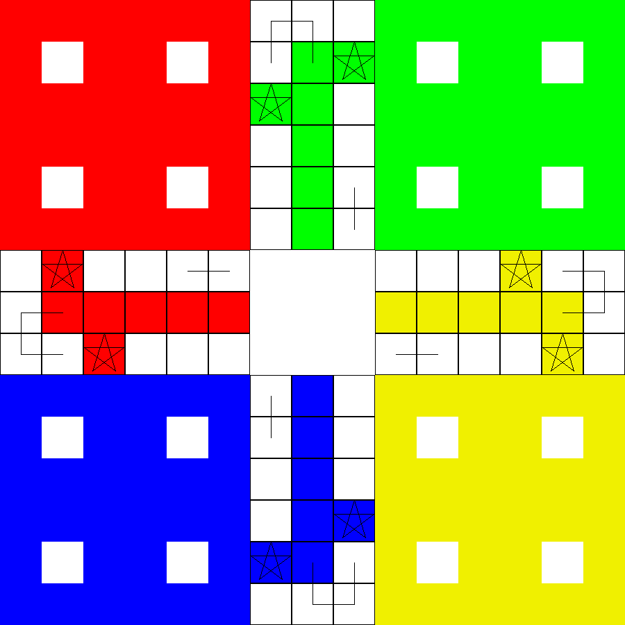

# LUDO

It is created in Linux based platform and work in linux platform only.
Before you play this one you must install `bash` and `SDL2` in your linux machine.

## HOW TO PLAY?

- To run the game simply you need to run the command `bash run.sh`.
- Then the first turn is or red so, to rotate the dice press `d` key in the keyboard.
- The we you press `d` key on keyboard then after the value of the dice will be shown of the center. And select the piece that you want to move.
- Only by `1` you can get you piece out of home.
- When you have got `1` or `6` you will get chance to rotate the dice once again.

The turn of the color is in the order;

1. Red Color
2. Green Color
3. Yellow Color
4. Blue Color
